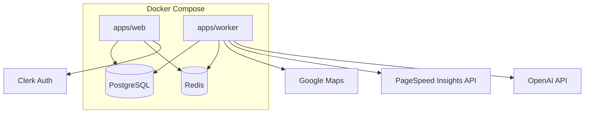

# LeadForge — Technical Specification

## Executive Summary

LeadForge is a greenfield TypeScript monorepo implementing a SaaS lead capture platform for Brazilian web agencies. The architecture separates the Next.js web/API layer from BullMQ workers running Playwright for Google Maps mining and site audits. OpenAI GPT-4o generates sales artifacts; Clerk handles auth; artifacts store as base64 in PostgreSQL.

**Primary trade-off:** Playwright scraping + in-DB artifact storage maximize MVP velocity and operational simplicity at the cost of scraper fragility (Maps DOM changes) and database growth from binary content — both mitigated with abstraction layers and a documented Phase 2 migration to object storage.

## System Architecture

### Component Overview

```
apps/web (Next.js 15)          apps/worker (BullMQ processors)
├── UI: search, CRM, dashboard  ├── search processor → MapsScraper (Playwright)
├── Route Handlers: REST + SSE  ├── analyze processor → SiteAuditor (Playwright + PSI)
└── Clerk middleware            └── artifacts processor → OpenAI + PDF gen

packages/db (Prisma/PostgreSQL)  packages/queue (BullMQ/Redis)
packages/shared (types, scoring, segments catalog)
```

**Data flow:**

1. User POST `/api/searches` → creates `SearchJob` → enqueues `search` queue
2. Worker scrapes Maps → upserts Leads → enqueues `analyze` per lead
3. Worker audits site → computes score → if high-opportunity (ADR-001) enqueues `artifacts`
4. Worker generates TXT/PDF via OpenAI → stores base64 in `artifacts` table
5. Frontend subscribes SSE `/api/jobs/:id/events` for progress

**External systems:** Google Maps (scraped via Playwright), PageSpeed Insights API, OpenAI API, Clerk.

### Deployment Topology (MVP)



## Implementation Design

### Core Interfaces

```typescript
// packages/shared/src/scraper/types.ts
export interface ScrapeSearchInput {
  segmentId: string;
  subcategoryId?: string;
  state: string;
  city: string;
  radiusKm: number;
  filters?: SearchFilters;
}

export interface ScrapedBusiness {
  name: string;
  category: string;
  address: string;
  city: string;
  state: string;
  phone?: string;
  website?: string;
  rating?: number;
  reviewCount?: number;
  mapsUrl: string;
}

export interface MapsScraper {
  scrape(input: ScrapeSearchInput): Promise<ScrapedBusiness[]>;
}
```

```typescript
// packages/shared/src/audit/types.ts
export interface SiteAuditResult {
  hasRealWebsite: boolean;
  sslValid: boolean;
  mobileResponsive: boolean;
  ownDomain: boolean;
  seoBasics: { title: boolean; metaDescription: boolean; h1: boolean };
  psi?: { performanceScore: number; lcp: number; cls: number; seoScore: number };
  problems: string[];
  opportunities: string[];
}

export interface SiteAuditor {
  audit(url: string): Promise<SiteAuditResult>;
}
```

```typescript
// packages/shared/src/scoring/score-calculator.ts
export interface ScoreInput {
  audit: SiteAuditResult | null;
  socialSignals: SocialSignals;
  googleBusiness: GoogleBusinessSignals;
}

export function calculateDigitalScore(input: ScoreInput): number;
export function isHighOpportunity(
  score: number,
  hasRealWebsite: boolean,
  threshold?: number
): boolean;
```

### Data Models

Prisma schema in `packages/db/prisma/schema.prisma`:

**User**

| Field | Type | Notes |
|-------|------|-------|
| id | String @id | Clerk user ID |
| name | String | |
| email | String @unique | |
| avatar | String? | |
| role | String | default `"user"` |
| settingsJson | Json | threshold, proposal defaults |
| createdAt | DateTime | |

**SearchJob**

| Field | Type | Notes |
|-------|------|-------|
| id | String @id @default(cuid()) | |
| userId | String | FK → User |
| segmentId | String | |
| subcategoryId | String? | optional per PRD |
| state | String | UF code |
| city | String | |
| radiusKm | Int | default 10 |
| filtersJson | Json? | website, rating, whatsapp, instagram filters |
| status | SearchJobStatus | pending \| running \| completed \| failed |
| progressPct | Int | 0–100 for SSE |
| totalFound | Int | default 0 |
| errorMessage | String? | |
| createdAt | DateTime | |
| completedAt | DateTime? | |

**Lead**

| Field | Type | Notes |
|-------|------|-------|
| id | String @id @default(cuid()) | |
| userId | String | FK → User |
| searchJobId | String | FK → SearchJob |
| name | String | |
| category | String | |
| address | String | |
| city | String | |
| state | String | |
| phone | String? | |
| whatsapp | String? | |
| email | String? | |
| website | String? | raw URL from Maps |
| instagram | String? | |
| facebook | String? | |
| rating | Float? | |
| reviewCount | Int? | |
| mapsUrl | String | |
| score | Int? | 0–100 |
| scoreBand | String? | critical \| low \| medium \| excellent |
| hasRealWebsite | Boolean | false if social-only or missing |
| diagnosisJson | Json? | full SiteAuditResult + social signals |
| status | LeadStatus | CRM enum from PRD |
| autoPipelineTriggered | Boolean | true if artifacts auto-enqueued |
| diagnosedAt | DateTime? | |
| createdAt | DateTime | |
| updatedAt | DateTime | |

**Contact**

| Field | Type | Notes |
|-------|------|-------|
| id | String @id @default(cuid()) | |
| leadId | String | FK → Lead |
| date | DateTime | |
| notes | String | |
| status | String | |
| nextContact | DateTime? | |
| createdAt | DateTime | |

**Proposal**

| Field | Type | Notes |
|-------|------|-------|
| id | String @id @default(cuid()) | |
| leadId | String | FK → Lead |
| value | Decimal | |
| monthlyFee | Decimal? | |
| scope | String | |
| deadline | String | |
| status | String | |
| observations | String? | |
| createdAt | DateTime | |

**Artifact**

| Field | Type | Notes |
|-------|------|-------|
| id | String @id @default(cuid()) | |
| leadId | String | FK → Lead |
| type | ArtifactType | company_txt \| analysis_txt \| website_brief_txt \| proposal_pdf \| diagnosis_pdf \| wireframe_pdf |
| filename | String | |
| mimeType | String | |
| contentBase64 | String @db.Text | max 5 MB raw before encoding |
| sizeBytes | Int | |
| createdAt | DateTime | |

**Prompt**

| Field | Type | Notes |
|-------|------|-------|
| id | String @id @default(cuid()) | |
| leadId | String | FK → Lead |
| title | String | |
| content | String @db.Text | OpenAI prompt/response log |
| createdAt | DateTime | |

**Indexes:** `Lead(userId, status)`, `Lead(searchJobId)`, `Lead(score)`, `Artifact(leadId, type)`, `SearchJob(userId, createdAt DESC)`.

### API Endpoints

| Method | Path | Description | Response |
|--------|------|-------------|----------|
| GET | /api/health | Health check | 200 |
| POST | /api/searches | Create search job | 201 `{ searchJobId }` |
| GET | /api/searches/:id | Job status + counts | 200 SearchJob |
| GET | /api/searches/:id/leads | Paginated leads (score ASC) | 200 `{ leads[], total }` |
| GET | /api/jobs/:id/events | SSE progress stream | text/event-stream |
| GET | /api/leads/:id | Lead detail + diagnosis + artifacts | 200 LeadDetail |
| PATCH | /api/leads/:id | Update CRM status | 200 Lead |
| POST | /api/leads/:id/analyze | Manual re-diagnosis | 202 `{ jobId }` |
| POST | /api/leads/:id/artifacts | Manual artifact pipeline | 202 `{ jobId }` |
| GET | /api/leads/:id/artifacts/:type | Download artifact | 200 binary |
| GET | /api/settings | User settings | 200 Settings |
| PATCH | /api/settings | Update settings | 200 Settings |
| POST | /api/leads/:id/contacts | Log CRM contact | 201 Contact |
| GET | /api/leads/:id/contacts | List contacts | 200 Contact[] |
| GET | /api/dashboard | Dashboard aggregates | 200 DashboardStats |

All routes require Clerk session except `/api/health`.

**SSE event types:** `progress`, `lead_scraped`, `lead_analyzed`, `artifact_ready`, `job_completed`, `job_failed`.

### Playwright Maps Scraper Design

Module: `apps/worker/src/scraper/maps-scraper.ts`

1. Resolve search query from segment catalog: `{subcategory} em {city} {state}`.
2. Navigate to `https://www.google.com/maps/search/{encoded_query}`.
3. Wait for results feed; scroll with 1–3s random delays until no new results or 120 cap reached.
4. For each result card, extract fields via stable selectors (abstracted in `selector-map.ts`).
5. Click card to open detail panel; extract phone, website, hours if missing from card.
6. Apply post-filters (`filtersJson`): min rating, has/doesn't have website, WhatsApp detectable from phone format.
7. Upsert leads; emit SSE `lead_scraped` events via Redis pub/sub.

**Concurrency:** Max 2 concurrent Playwright browser contexts for scraping.

### Artifact Pipeline Design

Module: `apps/worker/src/artifacts/artifact-processor.ts`

Triggered when `!hasRealWebsite || score <= threshold` (default 60, from user settings).

1. Build OpenAI prompt from lead data + `diagnosisJson`.
2. Generate structured outputs (JSON mode):
   - Diagnosis narrative
   - Wireframe structure (pages, sections, components)
   - `company.txt`, `analysis.txt`, `website-brief.txt` content
   - Proposal fields (scope, value, deadline, monthlyFee)
3. Render PDFs via `@react-pdf/renderer` templates.
4. Encode each file as base64; insert into `artifacts` table.
5. Create/update `Proposal` record.
6. Emit SSE `artifact_ready`.

**OpenAI model:** `gpt-4o` with temperature 0.4 for consistent outputs.

## Integration Points

| Service | Purpose | Authentication | Error Handling |
|---------|---------|----------------|----------------|
| Google Maps | Playwright scrape | N/A (browser session) | 3 retries with exponential backoff; fail job on CAPTCHA detection |
| PageSpeed Insights v5 | Performance/SEO metrics | `GOOGLE_PSI_API_KEY` | 2 retries; fallback to Playwright-only score with `psi_available: false` |
| OpenAI GPT-4o | Artifact text generation | `OPENAI_API_KEY` | 3 retries exponential backoff; timeout 120s per call |
| Clerk | User auth/session | `CLERK_SECRET_KEY`, publishable key | Clerk SDK error handling |

**Environment variables:**

```
DATABASE_URL
REDIS_URL
CLERK_SECRET_KEY
NEXT_PUBLIC_CLERK_PUBLISHABLE_KEY
OPENAI_API_KEY
GOOGLE_PSI_API_KEY
HIGH_OPPORTUNITY_THRESHOLD=60
SCRAPER_MAX_RESULTS=120
SCRAPER_CONCURRENCY=2
```

## Impact Analysis

| Component | Impact Type | Description and Risk | Required Action |
|-----------|-------------|---------------------|-----------------|
| PostgreSQL | New | Full schema + base64 blobs | Size monitoring; 5 MB cap per artifact |
| Redis | New | BullMQ queues + SSE pub/sub | Docker Compose service |
| Playwright worker | New | Maps scraper + site auditor | Dedicated Docker image with Chromium |
| Next.js app | New | Greenfield web + API | Monorepo scaffold |
| Clerk | New | Auth provider | Configure Clerk dashboard + webhooks for user sync |
| init.md entities | Extended | Lead fields expanded beyond init.md | Prisma schema as source of truth |

## Testing Approach

### Unit Tests

- **Framework:** Vitest in all packages; target 80%+ coverage per Compozy task rules.
- **Score calculator:** All bands (0–40, 41–60, 61–80, 81–100); no-website case; social-only URL case.
- **isHighOpportunity():** Boundary at threshold 60; manual override flag.
- **Segment catalog:** All 20 segments load; subcategory resolution.
- **Zod schemas:** Job payload validation rejects invalid UF/city/radius.
- **Mocks:** `MapsScraper`, `SiteAuditor`, OpenAI client injected via interfaces.

### Integration Tests

- Prisma CRUD with Testcontainers PostgreSQL.
- BullMQ: enqueue `search` job → mock scraper returns fixtures → leads persisted → `analyze` jobs enqueued.
- SSE endpoint: subscribe → receive `progress` and `job_completed` events.
- Artifact worker: mock OpenAI → base64 stored → download endpoint returns correct bytes.
- Maps scraper: HTML fixtures from recorded Maps pages (no live scraping in CI).

### E2E Tests

- Playwright Test against local Docker stack.
- Flows: Clerk login → create search → watch SSE progress → view lead → change CRM status → download artifact.

## Development Sequencing

### Build Order

1. **Monorepo scaffold** — pnpm workspaces, Turborepo, ESLint, TypeScript configs — no dependencies
2. **Docker Compose** — postgres + redis — depends on step 1
3. **Prisma schema + migrations** — depends on steps 1, 2
4. **packages/shared** — types, `segments.json`, Zod schemas, score calculator — depends on step 3
5. **packages/queue** — BullMQ queue definitions, job types — depends on steps 1, 2, 4
6. **Clerk auth + Next.js shell** — depends on steps 1, 3
7. **Search API + SSE endpoint** — depends on steps 5, 6
8. **Maps scraper worker (Playwright)** — depends on steps 4, 5
9. **Site auditor worker (Playwright + PSI)** — depends on steps 4, 5
10. **Score service + auto-pipeline trigger** — depends on step 9
11. **Artifact worker (OpenAI + PDF + base64 storage)** — depends on steps 9, 10
12. **CRM API endpoints** — depends on steps 3, 6
13. **Web UI** — search form, results list, lead detail, CRM kanban, dashboard — depends on steps 7, 12
14. **Settings + manual triggers** — depends on steps 10, 11, 13
15. **Test suite + CI pipeline** — depends on all above

### Technical Dependencies

- Clerk project configured before step 6.
- `OPENAI_API_KEY` before step 11.
- `GOOGLE_PSI_API_KEY` before step 9 (optional in dev with mock).
- Playwright Docker base image (`mcr.microsoft.com/playwright:v1.49.0-jammy`) before step 8.
- Segment catalog JSON extracted from init.md before step 4.

## Monitoring and Observability

**Metrics to track:**

- `search_job_duration_ms` — histogram
- `leads_scraped_count` — counter per job
- `analyze_job_duration_ms` — histogram
- `artifact_job_duration_ms` — histogram
- `psi_api_errors` — counter
- `scraper_captcha_count` — counter
- `openai_tokens_used` — counter per user

**Structured log fields:** `{ jobId, jobType, userId, leadId, durationMs, status, errorCode }`

**Alert thresholds:**

- Scraper job failure rate > 20% over 1 hour
- Artifact job failure rate > 10% over 1 hour
- PostgreSQL total size > 10 GB (base64 growth warning)

**Tools:** Sentry for error tracking; structured JSON logs to stdout for Docker log aggregation.

## Technical Considerations

### Key Decisions

| Decision | Rationale | Trade-offs | Alternatives Rejected |
|----------|-----------|------------|----------------------|
| TypeScript monorepo | User choice; Playwright native; shared types | Node API perf vs Go | Go+Node polyglot, Python FastAPI |
| Playwright Maps scraping | User requirement | DOM fragility, CAPTCHA risk | Outscraper API, Google Places API |
| Base64 in PostgreSQL | User requirement | DB bloat, decode memory | R2/S3 object storage |
| SSE for job progress | User choice | Connection limits on scale | Polling, WebSockets |
| OpenAI GPT-4o | User choice | Token cost | Anthropic, multi-provider abstraction |
| Clerk auth | User choice | Vendor cost per MAU | Auth.js, Supabase Auth |
| Playwright + PSI hybrid audit | User choice | Two failure modes | Playwright-only, Lighthouse in-process |

### Known Risks

| Risk | Likelihood | Mitigation |
|------|------------|------------|
| Google Maps CAPTCHA/blocking | Medium | Concurrency cap 2; random delays; user-facing retry button |
| Maps DOM selector breakage | High | Selector abstraction; fixture-based tests; alert on zero results |
| PSI API quota exhaustion (25k/day) | Low | Daily usage counter; Playwright-only fallback |
| PostgreSQL bloat from base64 PDFs | Medium | 5 MB/file cap; Phase 2 migration to R2 documented below |
| OpenAI latency/timeouts | Medium | 5 min job timeout; SSE partial progress; retry with backoff |
| LGPD data handling | Low | Public data only; delete cascade on lead; consent on signup |

### Phase 2 Migration Notes

- **Object storage:** Add `storageKey` column to `artifacts`; migrate base64 to Cloudflare R2; keep download API unchanged.
- **Maps API fallback:** Evaluate Google Places API as scraper fallback when CAPTCHA rate exceeds threshold.
- **Multi-provider AI:** Extract `ArtifactGenerator` interface; add Anthropic provider behind env flag.

## Architecture Decision Records

- [ADR-001: Smart Prospecting Pipeline Approach](adrs/adr-001.md) — Full artifact pipeline runs automatically only for high-opportunity leads (no website or score ≤ 60); manual trigger available for all.
- [ADR-002: Brazil-First Market with Fixed Segment Catalog](adrs/adr-002.md) — Launch Brazil-only with 20 fixed industry segments from init.md; no free-form keyword search in MVP.
- [ADR-003: TypeScript Monorepo with BullMQ Job Pipeline](adrs/adr-003.md) — pnpm monorepo with Next.js web, BullMQ workers, Prisma/PostgreSQL, Redis.
- [ADR-004: Playwright-Based Google Maps Lead Mining](adrs/adr-004.md) — Dedicated Playwright worker scrapes Google Maps by segment/location; up to 120 results per search.
- [ADR-005: Artifact Storage as Base64 in PostgreSQL](adrs/adr-005.md) — PDFs and TXTs stored as base64 in `artifacts` table; 5 MB cap per file; R2 migration in Phase 2.
- [ADR-006: Hybrid Site Audit (Playwright + PageSpeed Insights)](adrs/adr-006.md) — Playwright heuristics plus PSI API for Core Web Vitals; weighted 0–100 score calculator.
